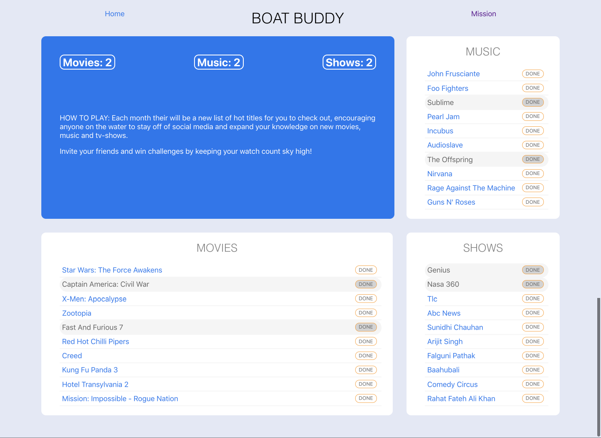

# Boat Buddy
A socially responsible application for Scuba-divers and boaters alike to stay off of social media while out on the water. A monthly challenge app that suggests movies, music, and tv-shows for you to watch to earn points.

### See it Live
[See it Live here!](https://jstewart3313.github.io/Boat-Buddy/.)

### APIs Used
* tasteDive API 

### Primary Javascript technologies
* React
* React Router
* Redux
* React-Redux

### Setup

1. Clone down repo
2. `npm install` from root directory
3. `npm start` and visit `localhost:3000` in your browser

### Test Driven Development

Boat Buddy uses Jest and Enzyme for all testing purposes

`npm test` from the associated root directory

### Next Steps
Additional enhancments could include :
* Allow user to refresh challenges and continue more if they complete the default categories.
* Allow users to invite friends to private challenges.
* Allow customers to remove categories && add Books as a 4 category

### ScreenShots

#### Desktop Version

### Original Assignment

[Binary-Challenge](http://frontend.turing.io/projects/binary-challenge.html) from the Turing School of Software & Design

### Contributors

Justin Stewart: [Github](https://github.com/Jstewart3313)
